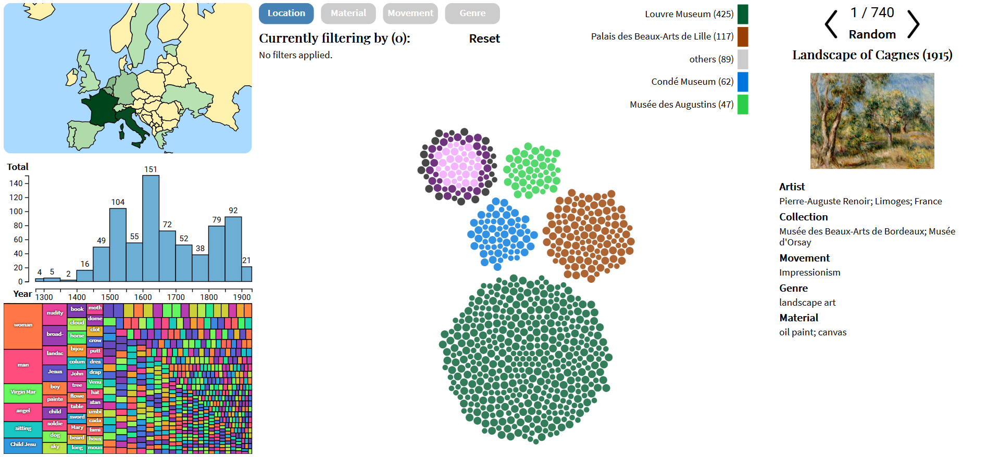

# Paintings by Comparison

You think you've seen paintings? Well you've never seen them like this before! We present "Paintings by Comparison".

## How to Use

Coming soon!

## Installation

_Relax, it won't take that much time to install :)_

First, clone this repo to your local machine, then move ahead.

### Important Notes

- If you need to run different versions of Node.js in your local environment, consider installing:
  - [Node Version Manager (nvm)](https://github.com/creationix/nvm) or 
  - [Node Version Manager (nvm) for Windows](https://github.com/coreybutler/nvm-windows)
- Install these **BEFORE** your first installation of Node.js! 
  - If you already have Node.js installed, look up how to remove it before getting nvm.

### Install Node.js, npm and packages

1. Install [Node.js v14.15.0 LTS](https://nodejs.org/en/) and [npm v6.14.8](https://docs.npmjs.com/cli/npm)
   - You can download a Node.js installer for your operating system from <https://nodejs.org/en/download/>
   - By installing Node.js, you also get npm, which is a command line executable for downloading and managing Node.js packages.
     - Check the version of Node.js and npm that you have installed by running `node -v` and `npm -v` from the command line/terminal
   - Be careful of conflicting with existing installations of Node.js on your machine! See [Important Notes](<README.md#important-notes>) above.
2. Open your command line/terminal and navigate to the _app/_ directory of this repo
3. Run `npm install`
   - installs required libraries from _package.json._
4. You can now develop all your code logic! Just keep `index.html`, `index.js`, and `package.json` where they are :)

### Testing

1. If not already there, navigate to the _app/_ directory of this repo.
2. Run `npm run build` in the same directory.
   - This should build the project to a _dist/_ folder in the same directory.
3. Spin up a local webpage rooted in the _app/_ directory
   - For example, if you have Python3 installed, run `python -m http.server 3000`
   - Once your local server is running go to your browser at <https:localhost:3000>
4. When you want to close the server, press `COMMAND/CTRL+C` in the terminal/command window

## Acknowledgement

Designed for CS 7450 Information Visualization, Georgia Institute of Technology, Prof Alex Endert, Fall 2020.

Developed by Adam Coscia ([acoscia6@gatech.edu](mailto:acoscia6@gatech.edu)) and Vijay Marupudi.

Thank you to Rojin Aliehyaei and Akshay Karthik for their help!

## License Information

> Licensed under the Apache License, Version 2.0 ([Link](http://www.apache.org/licenses/LICENSE-2.0))
